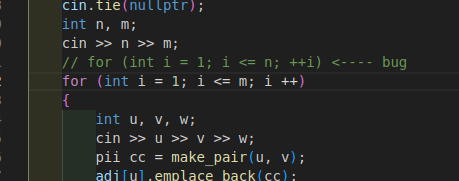

Team 8, bai 1: checker.cpp

Team 8, bai 2: solution.cpp

Team 8, bai 2: checker.cpp

Team 10, bai 1: checker.cpp

Team 10, bai 2: checker.cpp

Team 10, bai 2: solution.cpp

Team 12, bai 2: solution.cpp

Team 12, bài 2: gen...cpp

Team 13, bài 3: checker.cpp

Team 13, bai 3: solution.cpp

Team 17, bài 2: gen...cpp

-> Thay bằng ouf.seekEof() để bỏ qua trường hợp cuối file là dấu xuống dòng