# Hướng dẫn giao diện sử dụng github

## Các chức năng
- Giao diện của một github:

### 1: Code.
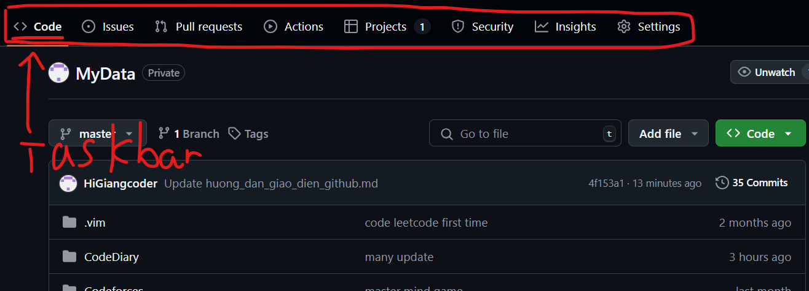

- Hiển thị toàn bộ mã nguồn của dự án trong repository. Bạn có thể xem, tải xuống, hoặc sao chép (clone) về máy tính cá nhân.
#### 1.1: **Branch**: Danh sách các nhánh (branches) trong repository.
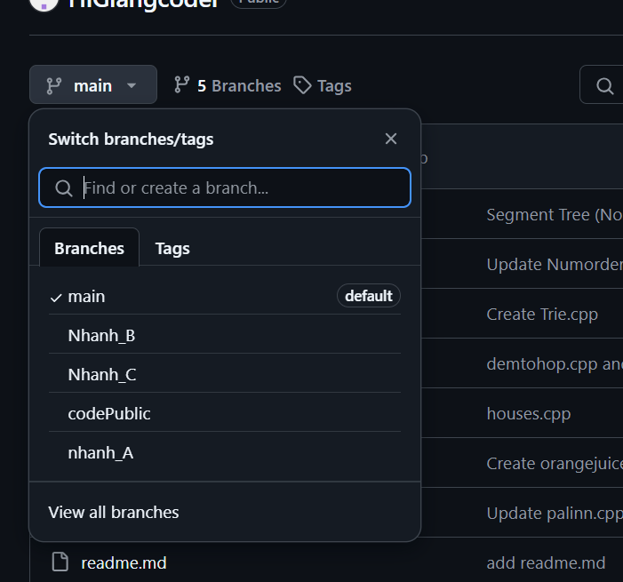

#### 1.2: **Clone or Download**: Cho phép sao chép liên kết để clone repository về máy hoặc tải về dưới dạng file ZIP.
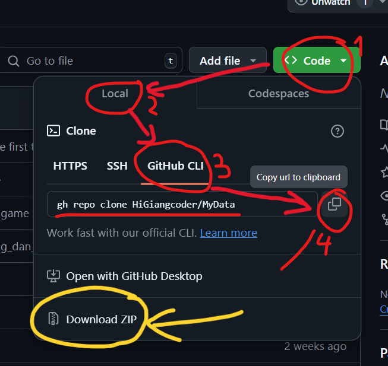

#### 1.3: **Commit History**: Xem lịch sử các lần thay đổi (commit) mã nguồn.
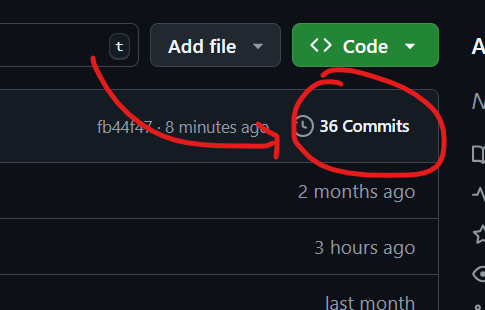
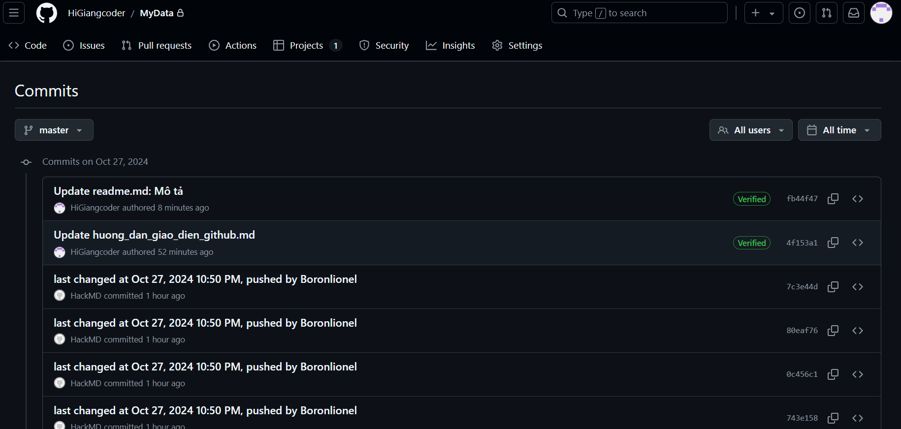

#### 1.4: **Readme**: github cho phép hiển thị trực tiếp file readme.md để người dùng có thể đọc giới thiệu về repository đó
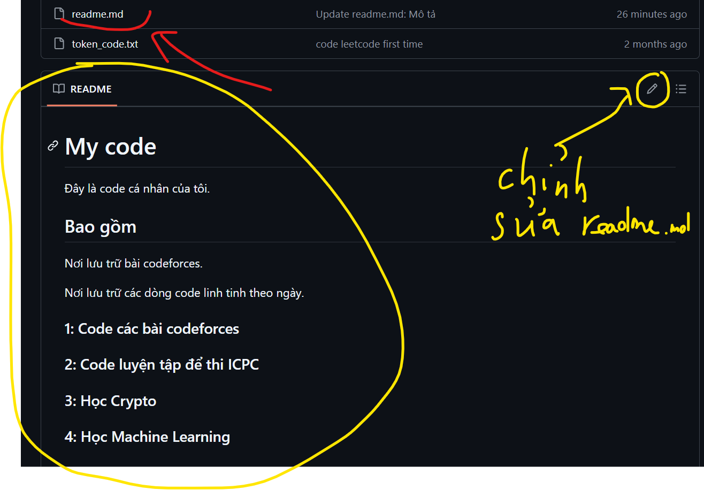
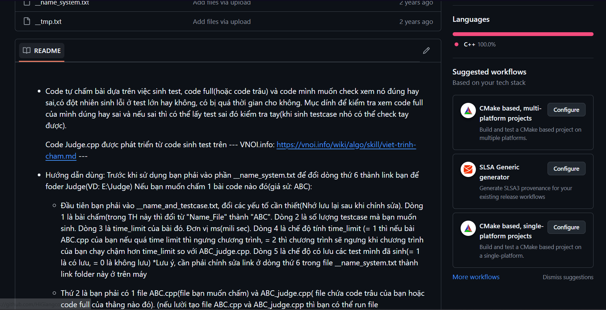

### 2: Issues.
- Phần này dùng để quản lý các vấn đề, bug hoặc yêu cầu cải tiến liên quan đến dự án. Bạn có thể tạo mới, đóng, hoặc thảo luận về các issues (vấn đề).

Giao diện Issues.
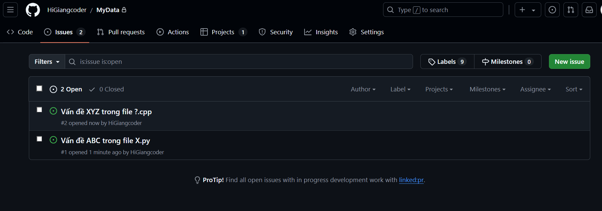
Ảnh thảo luận.
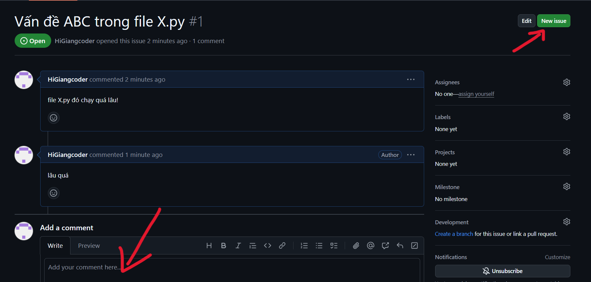
Ảnh đóng.
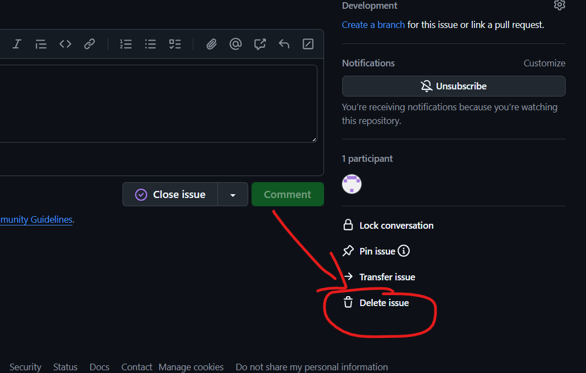

### 3: Pull Requests (PRs).
- **Mục đích:** Pull request thường được sử dụng khi bạn đã hoàn thành một số thay đổi trong mã nguồn, và bạn muốn đưa những thay đổi đó vào repository chính.

- Chọn nhánh chính và nhánh bạn muốn đưa vào nhánh chính.
- Nhấn nút tạo yêu cầu.
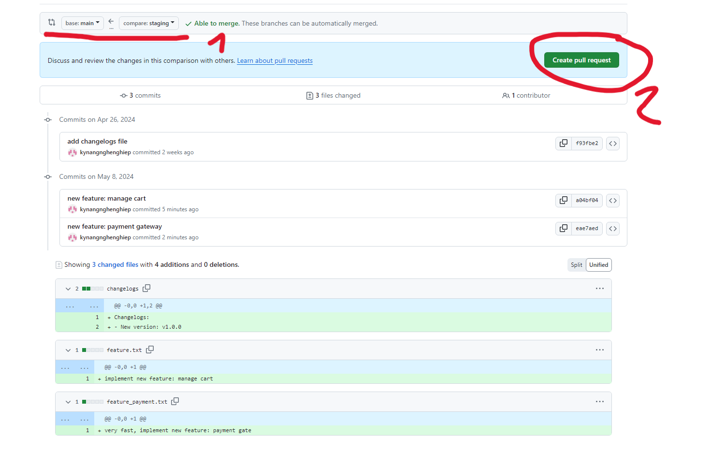
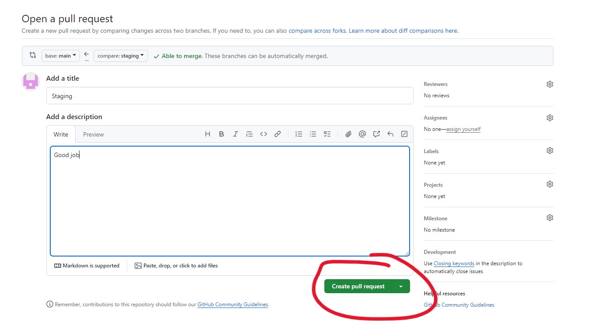

- **Thảo luận và Xem xét:** Khi một PR được mở, các thành viên khác trong dự án có thể thảo luận về các thay đổi, xem xét mã, và đề xuất các chỉnh sửa. Điều này giúp cải thiện chất lượng mã và hợp tác giữa các lập trình viên.
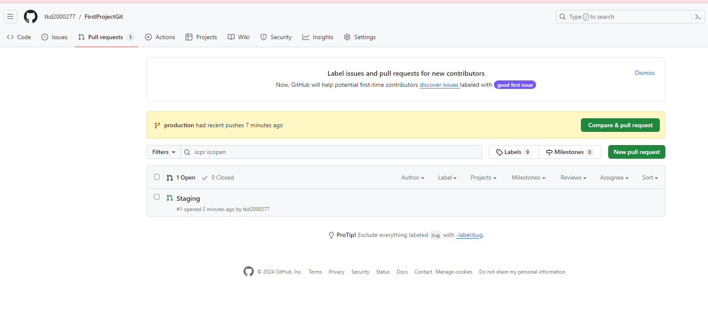
- **Kiểm tra:** Bạn có thể chạy các kiểm tra tự động (CI/CD) để đảm bảo rằng các thay đổi không phá vỡ chức năng của mã hiện tại.
Tích hợp: Nếu tất cả các bên liên quan đồng ý với các thay đổi, pull request có thể được hợp nhất vào nhánh chính.
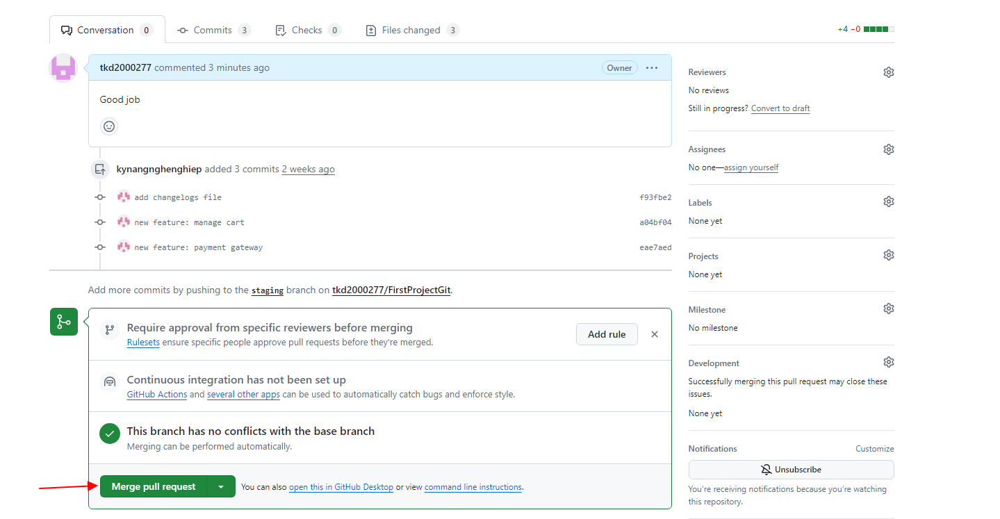
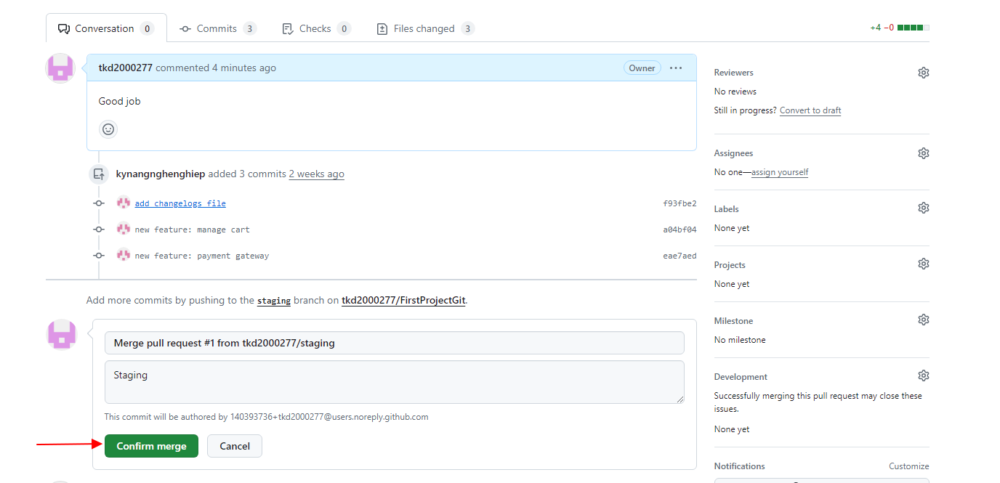

### 4: Actions.
GitHub Actions (hành động) giúp bạn tự động hóa các quy trình phát triển, như kiểm tra mã, triển khai ứng dụng, v.v.

- **Tự động hóa:** Bạn có thể tự động hóa các tác vụ lặp đi lặp lại. Ví dụ, mỗi khi có ai đó tạo pull request, bạn có thể cấu hình GitHub Actions để tự động kiểm tra (run tests), xây dựng (build), và thậm chí triển khai ứng dụng.
- **Workflow:** GitHub Actions được cấu hình thông qua các workflow (luồng công việc). Mỗi workflow bao gồm một chuỗi các hành động mà bạn muốn thực hiện khi có một sự kiện xảy ra (như push mã, tạo pull request, hoặc tạo release).
- **YAML File:** Các workflow được định nghĩa trong các file có định dạng YAML và được lưu trữ trong thư mục `.github/workflows/`.
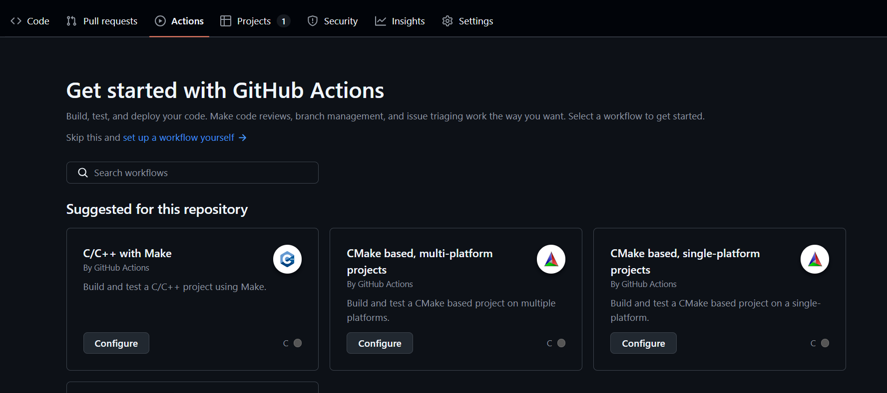

### 5: Projects.
Dùng để quản lý dự án theo kiểu bảng Kanban (một hệ thống quản lý công việc trực quan). Bạn có thể theo dõi tiến độ công việc, sắp xếp nhiệm vụ và vấn đề một cách có hệ thống.

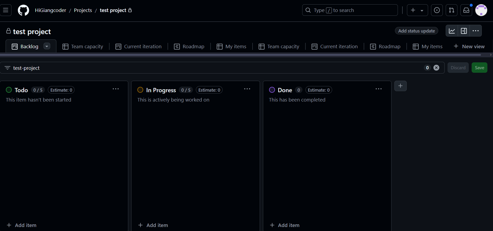
- **Tổ chức công việc:** GitHub Projects cho phép bạn tạo các cột (columns) như "To Do" (Cần làm), "In Progress" (Đang làm), và "Done" (Hoàn thành) để sắp xếp các nhiệm vụ (task) của mình.
- **Các thẻ (cards):** Mỗi nhiệm vụ hoặc công việc được đại diện bởi một card (thẻ). Mỗi card có thể liên kết với một issue (vấn đề), pull request hoặc bạn có thể tạo một card trống để theo dõi công việc.
- **Tùy chỉnh:** Bạn có thể tùy chỉnh các cột theo cách riêng của bạn, ví dụ: tạo thêm các cột cho các giai đoạn của dự án.
- **Tự động hóa:** Một số tác vụ có thể tự động chuyển trạng thái (từ "In Progress" sang "Done") khi các pull request hoặc issue được cập nhật.

### 6: Wiki.
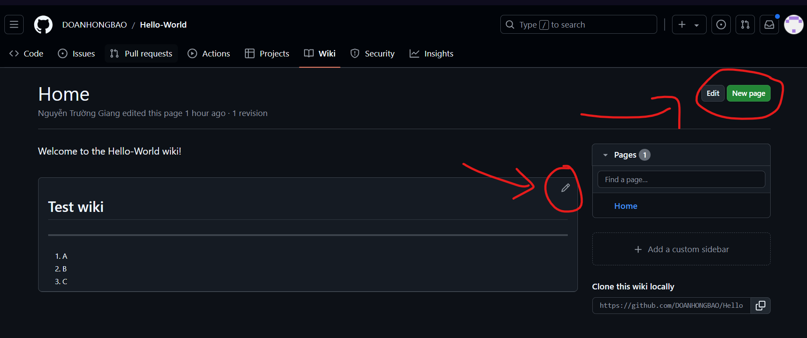
Một không gian nơi người dùng có thể thêm tài liệu cho dự án. Wiki được dùng để lưu trữ tài liệu hướng dẫn, kiến thức liên quan đến repository(tính năng nạp vip).

### 7: Security.
Giúp bạn quản lý các vấn đề liên quan đến bảo mật của dự án, bao gồm việc phát hiện và giải quyết các lỗ hổng bảo mật, đảm bảo rằng mã nguồn và các thư viện phụ thuộc của bạn an toàn. GitHub cung cấp nhiều tính năng và công cụ để bảo vệ repository của bạn khỏi các rủi ro bảo mật.

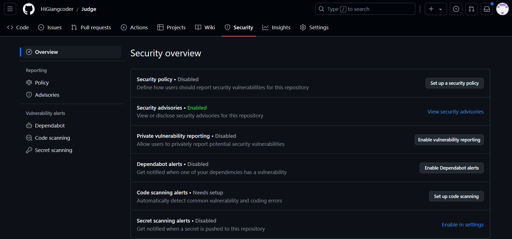
1. Các tính năng chính trong phần Security
- 1.1 Dependabot alerts (Cảnh báo phụ thuộc)
- 1.2 Secret Scanning (Quét mã bí mật)
- 1.3 Security Policy (Chính sách bảo mật)
- 1.4 Vulnerability Alerts (Cảnh báo lỗ hổng)
- 1.5 Code Scanning (Quét mã)
- 1.6 Branch Protection Rules (Quy tắc bảo vệ nhánh)

### 8: Insights.
Insights trong GitHub cung cấp một cái nhìn tổng quan về hoạt động, hiệu suất và sức khỏe của dự án. Nó giúp bạn phân tích các thông số quan trọng của repository để có thể hiểu rõ hơn về quá trình phát triển, sự tham gia của cộng đồng, và các yếu tố khác. Insights rất hữu ích khi bạn muốn theo dõi sự tiến bộ và tính minh bạch của dự án.

Dưới đây là các phần chính trong GitHub Insights:

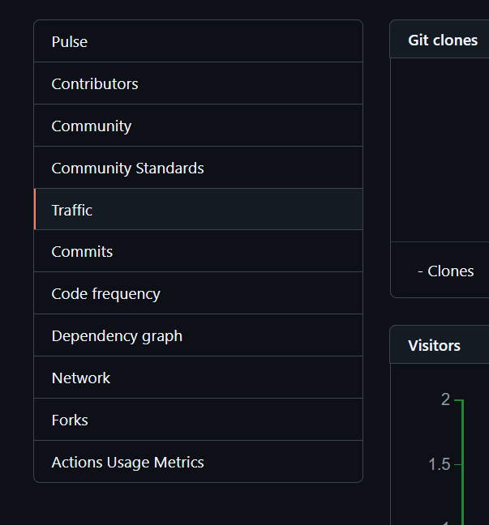

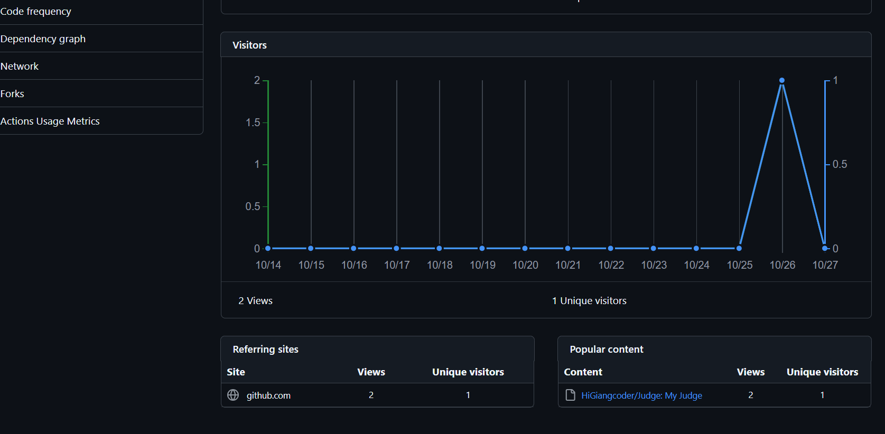
- 1. Contributors (Người đóng góp)
- 2. Commits (Lịch sử commit)
- 3. Code Frequency (Tần suất mã)
- 4. Punch Card (Biểu đồ hoạt động theo giờ)
- 5. Traffic (Lưu lượng truy cập)
- 6. Forks (Nhánh)
- 7. Network (Mạng lưới fork)
- 8. Releases (Phiên bản phát hành)
- 9. Dependency Graph (Biểu đồ phụ thuộc)
- 10. Community (Cộng đồng)

### 9: Settings
Settings (cài đặt) trong GitHub cho phép bạn quản lý các khía cạnh khác nhau của repository, từ quyền truy cập, cài đặt branch, bảo mật cho đến các công cụ tích hợp và quản lý dự án. Đây là nơi bạn tùy chỉnh các tùy chọn liên quan đến việc quản lý repository và kiểm soát những ai có thể tham gia phát triển, sử dụng hoặc sửa đổi nó.

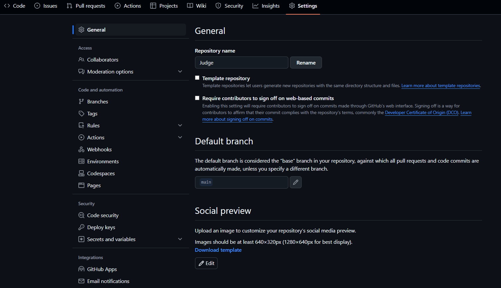
Dưới đây là chi tiết các mục trong Settings:

- 01. Repository Name & Description (Tên và mô tả repository)
- 02. Collaborators & Teams (Cộng tác viên & Nhóm)
- 03. Branches (Nhánh)
- 04. Webhooks (Cấu hình webhook)
- 05. Integrations & Services (Tích hợp & dịch vụ)
- 06. Secrets and Variables (Mã bí mật và biến môi trường)
- 07. GitHub Pages
- 08. Actions Permissions (Quyền truy cập Actions)
- 09. Code & Issues (Mã nguồn và Vấn đề)
- 10. Moderation settings (Cài đặt điều tiết)
- 11. Archived & Transfer (Lưu trữ & Chuyển giao repository)
- 12. Danger Zone (Vùng nguy hiểm)

---
### Các nguồn được tham khảo:

https://chatgpt.com

https://tedu.com.vn/kien-thuc/bai-9-thao-tac-merge-va-pull-request-383.html

